# eCredits Webshop Plugins

The eCredits webshop plugins are ready made addins for popular webshops that you can use to accept eCredits. These plugins
are available for:

- WooCommerce: <https://wordpress.org/plugins/ecredits/>
- Magento: <https://marketplace.magento.com/thepeoplessce-ecredits.html>

## Prerequisites

Please make sure to have the following ready before you start the installation of the eCredits webshop plugin:

- A merchant account with an active merchant subscription
- A configured online store (via the web portal)
- Installed and configured eWallet for the merchant account

## Configuration Parameters

The configuration of the webshop addins require the following information that you can find in <https://portal.ecredits.com>:

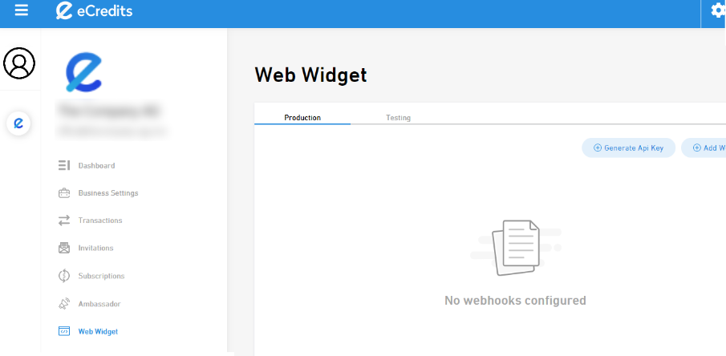

- Store ID: Is the ID of your store, if you have multiple ones.
- Profile ID: Is the ID of your merchant profile.
- Segment ID: If you offer a cashback merchant, this segment ID allows you to set the cashback segment.
- Secret: The generated API secret.
- Client ID: The client ID of the API.
- Webhook secret: The secret of the webhook.

## Magento Addin

1. Login to the admin panel of Magento
2. Navigate to Find Partners & Extensions

3. Click on View Magento Marketplace

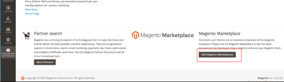

4. Search for eCredits on the Magento Marketplace

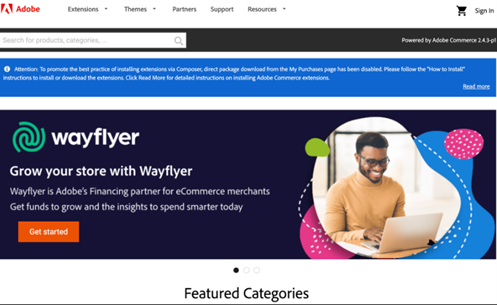

5. Add extension to cart

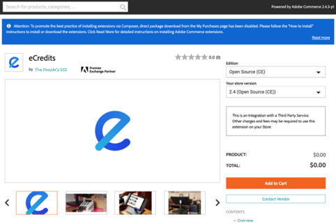

6. Proceed to checkout

7. After redirect click on Install button

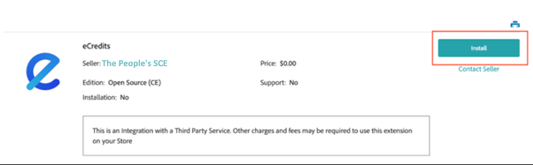

8. Follow the installation process

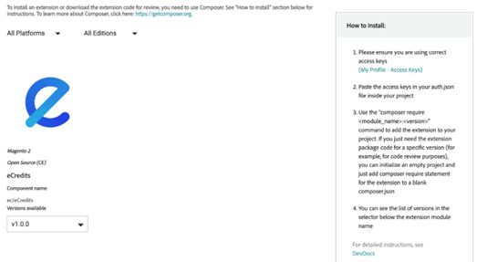

9.  Navigate to Configuration

10. Navigate to Sales then select Payment methods

11. Configure and save the extension

- Login to your business profile at <https://portal.ecredits.com>
- Navigate to "Web Widget" and generate a new API key. (The key is displayed and you can directly copy it. Copy it to any editor of your choice. The key can be deleted , and replaced with another key in the future in case you lost the key, simply generate a new one, using the Button again. Once a Key is generated, do not forget to add your webhook to your online-store.)
- Click Add Webhook and configure the URL of your webhook. The URL is shown in Magento. You may amend the webhook by deleting it, and add a new one later in case you made a mistake here.
- Navigate to Business Settings - Stores, click the details of your online store and navigate to Webshop Config
- Copy the IDs 1:1 into the config of the plugin in your store's configuration section
- Click Save

## Prestashop Addin

In case you want to inform yourself about the official documentation of prestashop you may find the information here: <https://www.youtube.com/watch?v=nG3VSMQ593s&t=125s>.  

1. navigate to module manager, after that you will need to get the module eCredits. You will be able to find module on the prestashop Addons marketplace (<https://addons.prestashop.com/en/>).

2. Search for the module eCredits

3. Click on the button Free

4. Press on Download button

5. Fill in the modal information

6. Select your version and it will start download of the module.

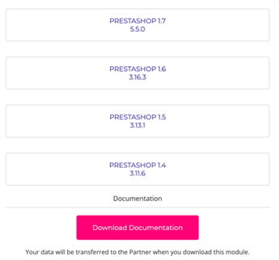

### Install and enable eCredits module

Next is the installation of the module and basic setup to allow it to work on the store.

1. Open the Module Manager in Prestashop admin panel.
2. Click on Upload a module.

3. Drag and drop or use finder to select the .zip file of the module.

4. After installation click on **configure** button.

5. Enter the API Information:

- Login to your business profile at <https://portal.ecredits.com>
- Navigate to "Web Widget" and generate a new API key. (The key is displayed and you can directly copy it. Copy it to any editor of your choice. The key can be deleted , and replaced with another key in the future in case you lost the key, simply generate a new one, using the Button again. Once a Key is generated, do not forget to add your webhook to your online-store.)
- Click Add Webhook and configure the URL of your webhook. The URL for WooCommerce is: `https://yourshop.com/index.php?fc=module&module=ecredits&controller=webhook`. Please replace "yourshop.com" with your url.
- Navigate to Business Settings - Stores, click the details of your online store and navigate to Webshop Config
- Copy the IDs 1:1 into the config of the plugin in your store's configuration section
- Click Save

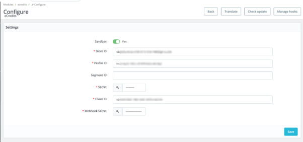

6. Enable EUR as currency and enable the eCredits option checkbox, click Save

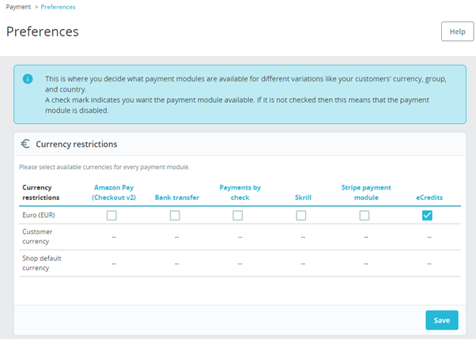

## WooCommerce Addin

1. Login to the admin panel of your Wordpress installation.
2. Navigate to plugins.

3. Search for eCredits and click on install now button.

4. Activate the plugin after installation by pressing Activate button.

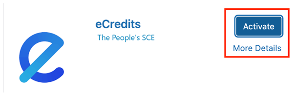

5. Navigate to WooCommerce settings, choose payment and enable and manage the method (eCredits).

6. Enter the API Information:

- Login to your business profile at <https://portal.ecredits.com>
- Navigate to "Web Widget" and generate a new API key. (The key is displayed and you can directly copy it. Copy it to any editor of your choice. The key can be deleted , and replaced with another key in the future in case you lost the key, simply generate a new one, using the Button again. Once a Key is generated, do not forget to add your webhook to your online-store.)
- Click Add Webhook and configure the URL of your webhook. The URL for WooCommerce is: `https://yourshop.com/wc-api/e-credits_response`. Please replace "yourshop.com" with your url.
- Navigate to Business Settings - Stores, click the details of your online store and navigate to Webshop Config
- Copy the IDs 1:1 into the config of the plugin in your store's configuration section
- Click Save

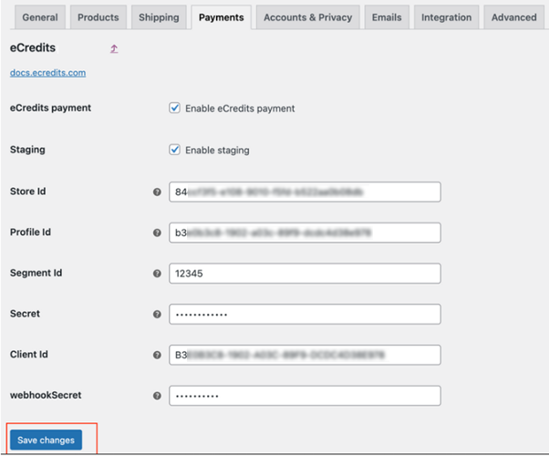
